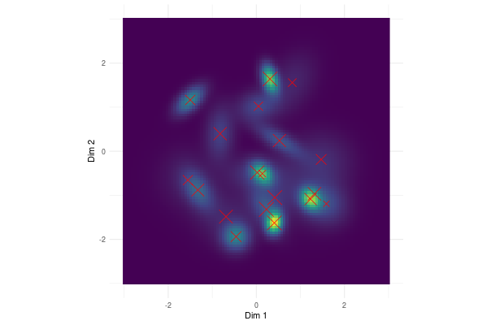
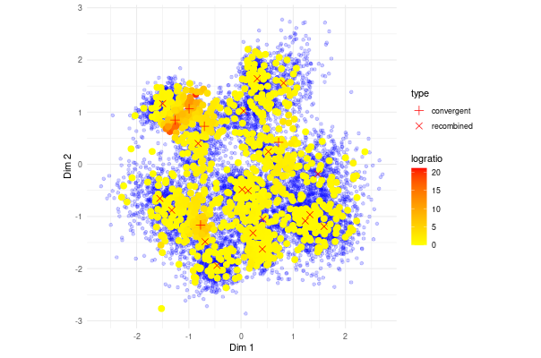
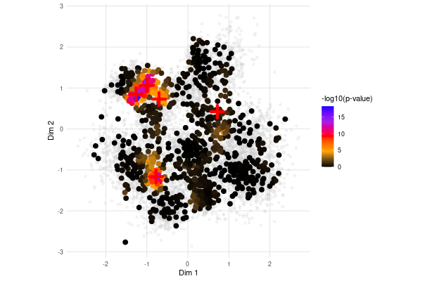
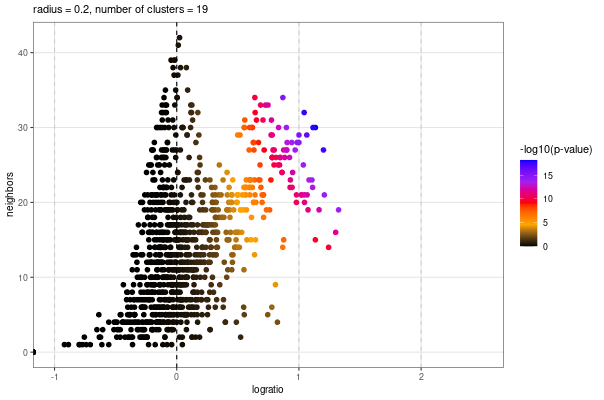

# Neighbor Analysis Modeling - Shiny App

This repository contains a Shiny app written in R, designed to model neighbor analysis with customizable parameters.

## Overview

The app generates random background Complementarity-Determining Region 3 (CDR3) clusters and 'convergent' CDR3 clusters, then performs neighbor analysis to produce common plots and statistical outputs. This allows for the visualization of how cluster properties impact the resulting p-values and plot characteristics.

The app is hosted at <https://twverdonckt.shinyapps.io/neighbor_shiny/>

## Key Features

-   **Random Background and Convergent Cluster Generation**: The app creates random CDR3 clusters alongside 'convergent' clusters to model various neighborhood structures.
-   **Neighbor Analysis**: Performs neighbor analysis to evaluate spatial relationships within generated clusters. Calculates p-values for each point using hypergeometric distribution (phyper).
-   **Plot Generation**: Produces commonly used plots to help interpret the effects of:
    -   Cluster size and count
    -   Topology
    -   Other customizable parameters

## Plots

Based on the chosen parameters, a (semi)random two-dimensional background CDR3 distribution is generated. The cluster centers are indicated by the red crosses and the generation probability by the gradient colors.

### Recombination pGen Plot

Next, background and 'sampled' CDR3s are simulated based on the 'Number of sampled CDR3s' and 'Ratio' parameters. The sampled CDR3s are generated from all background clusters plus a specified number of convergent clusters. The centres of the two cluster types are indicated. For each sampled CDR3, the logratio is calculated with the formula:

$$\text{logratio} = \frac{\text{sampled_CDR3s}}{\left(\frac{\text{background_CDR3s} + 1}{sample\_ratio}\right)}$$

The sample and background CDR3s and are plotted on the same dimensions. The sample CDR3s are colored based on their logratio values.

### Logratio Plot

Similarly, the neighbor enrichment p-value is calculated for each CDR3 using hypergeometric distribution. Both CRD3 types are once more plotted in the same dimensions, with the sampled CDR3s colored based on the negative log10 of their p-values.

The centres of convergent clusters are indicated by the red crosses.

### p-value Plot

Finally, a neighbour enrichment analysis plot is generated where each sampled CDR3 is again colored based on the negative log10 of their p-values.

### Neighbour enrichment Plot

## Important Notes

-   **No TCRdist3 Metrics**: The app does not employ TCRdist3 or related distance metrics. The 'radius' parameters refers to the geometric distance between CDR3s on the pGen plot.
-   **No Real CDR3 Sequences**: It operates purely on generated clusters and does not simulate actual CDR3 sequences.

## Getting Started

1.  Clone this repository: `bash     git clone https://github.com/TWV-GIT/Neighbor_Shiny.git`
2.  Open the Shiny app in R or RStudio and run `shiny::runApp("path/to/your/app")` to start the application.

## Dependencies

Make sure the following R packages are installed: - **Shiny** - **dplyr** - **ggplot2** - **MASS** - **mvtnorm** - **tidyr** - **data.table**

Install dependencies with: \`\`\`r install.packages(c("shiny", "dplyr", "ggplot2", "MASS", "mvtnorm", "tidyr", "data.table"))
